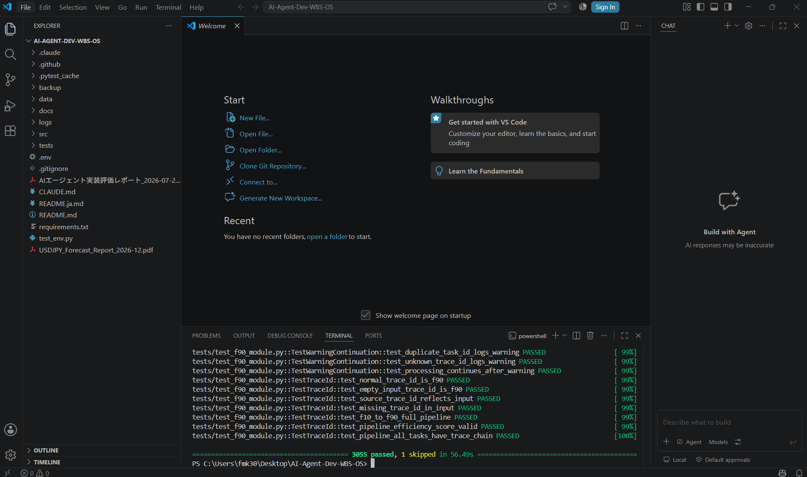

# AI-Agent-Dev-WBS-OS

**AI導入支援エージェント × AIWBS作成エージェント**

[English README](./README.md) | 日本語版（本ページ）


> **Claudeによる独立レビューの要約**：実際のソースコードを読み、一部はClaudeの環境で実行して検証した結果、
> **「公開・販売に値する質」と判断（Yes）**。安全設計（HITL・監査ログ）もWBS通りに実装されていることを確認済み。
> ※全ファイルを網羅した監査ではありません。詳細は [Claudeによる評価](#claudeによる評価) を参照してください。

---

## 目次

- [プロジェクト概要](#プロジェクト概要)
- [設計思想：なぜ汎用型エージェントなのか](#設計思想なぜ汎用型エージェントなのか)
- [パイプライン構成](#パイプライン構成)
- [特徴（Features）](#特徴features)
- [出力例](#出力例)
- [ディレクトリ構造](#ディレクトリ構造)
- [インストール](#インストール)
- [使い方（基本フロー）](#使い方基本フロー)
- [テスト（品質証明）](#テスト品質証明)
- [既知の制限事項](#既知の制限事項)
- [Claudeによる評価](#claudeによる評価)
- [ドキュメント](#ドキュメント)
- [ライセンス](#ライセンス)
- [作者](#作者)

---

## プロジェクト概要

AI導入支援エージェント（プロトコル型）と AIWBS作成エージェント（コード型）を組み合わせた、
「AI導入プロセスを構造化し、再現性のあるWBSを自動生成する」ためのオープンソースプロジェクトです。

## 設計思想：なぜ汎用型エージェントなのか

このプロジェクトは、特定の業界・専門分野に特化せず、あえて汎用的な設計を採用しています。これは制約ではなく、現在のAI（Claudeを含む）の能力特性を踏まえた意図的な選択です。

2026年の調査によれば、最新のAIは法律・化学などの専門分野の試験で専門家レベル、あるいはそれを上回るスコアを記録する一方、「ジャギーな能力（jagged capabilities）」——難しいベンチマークで高得点を取りながら基礎的なタスクで失敗する現象——が指摘されています。さらに、企業でのエージェント型AI活用では、実験室でのベンチマークスコアと実際の運用性能の間に約37%のギャップがあるとも報告されています（出典は末尾参照）。

つまり、現在のAIは「特定分野の最先端・高難度な専門的判断」には未だ届かない一方、「多くの分野における標準的・実務レベルの構造化・整理作業」には十分対応できる実力を持っています。WBS（Work Breakdown Structure）作成という本プロジェクトの中核タスク——曖昧な目的を実行可能な形に構造化する作業——は、まさに後者に該当します。

この特性を踏まえ、本プロジェクトは以下の設計方針を取っています。

- **汎用エンジンとして設計**：F10のシステムプロンプト（[`src/prompts/f10_system.txt`](./src/prompts/f10_system.txt)）はドメイン非依存であり、業界特有の知識をコードに埋め込んでいません。専門性はAIモデル自身の一般知識に委ねています
- **HITL（人間確認）による補完**：AIの専門性が届かない領域は、HITLの仕組みによって人間の判断を要所で挟むことを前提としています。AIが完璧な専門家であることを前提とせず、それを補う設計です

「専門特化型エージェント」ではなく「汎用型エージェント＋人間による確認」という組み合わせは、現在のAIの実力を踏まえた、意図的かつ現実的な設計判断です。

*出典：[International AI Safety Report 2026](https://arxiv.org/pdf/2602.21012)、[AI Benchmarks 2026: Top Evaluations and Their Limits](https://kili-technology.com/blog/ai-benchmarks-guide-the-top-evaluations-in-2026-and-why-theyre-not-enough)*

## パイプライン構成


F10のみClaude APIを呼び出します（目的文の構造化に言語モデルの推論力を使用）。F20〜F90は外部APIを必要とせず、標準ライブラリのみで決定的に動作します。

## 特徴（Features）

### AI導入支援エージェント（プロトコル型）

- 目的抽出
- 必要情報整理
- 制約条件分析
- HITL（曖昧語検出）
- 構造化ロジック（階層化）

エージェント定義は [`.claude/agents/ai-donyu-shien.md`](./.claude/agents/ai-donyu-shien.md) にあります。役割定義とシステムプロンプトそのものが実装であり、コード化していません（構造化は言語モデルの推論能力に依存するタスクのため）。

### AIWBS作成エージェント（コード型）

- F10〜F90 のパイプライン構造
- MECEチェック（コサイン類似度、自前実装）
- 階層生成（Union-Find、自前実装）
- トレーサビリティ生成
- 優先度テンプレート（HIGH / MEDIUM / LOW）

### 安全設計（HITL・監査ログ）

- 曖昧語検出・粒度不足判定（F10モジュール内に実装）
- `HITLTracker`：承認率の算出・誤承認検知（承認率90%超で警告）・保留遅延検知
- `MonitoringHandler`：ERROR / WARNING / RETRY / HITL の4分類でアラートを発火し、監査ログ（`docs/phase4/logs/summary.log`）に記録

### テスト網羅性

- 500関数・590テストケース（開発時点の実行記録。詳細は `backup/BACKUP_REPORT.md` を参照）
- F20〜F90はAPI不要（標準ライブラリのみ）で、Claudeの環境でも独立にimport・パイプライン実行を確認済み
- GitHub Actionsで push / PR ごとに自動実行（上部バッジ参照）

## 出力例

以下は実際にF10→F90を通しで実行した結果の抜粋です（`goal_text: "新規顧客獲得を強化し、売上を前年比120%に成長させる"`）。

**F10（目的構造化）の出力：**

```json
{
  "trace_id": "F10",
  "hitl": false,
  "goal": {
    "L1": "売上を前年比120%に成長させる",
    "L2": [
      "新規顧客獲得施策を推進する",
      "既存顧客リテンションを強化する"
    ],
    "L3": [
      "LPを作成する",
      "広告配信を開始する",
      "フォローアップメールを設計する"
    ]
  }
}
```

**F90（最終出力）のサマリー：**

```json
{
  "total_goals": 6,
  "total_elements": 6,
  "total_tasks": 6,
  "pipeline_integrity": "verified",
  "traceability_complete": true
}
```

## ディレクトリ構造

```
AI-Agent-Dev-WBS-OS/
├── src/
│   ├── agents/        # F10〜F90 モジュール（AIWBS作成エージェント本体）
│   ├── monitoring/     # HITLTracker / MonitoringHandler（安全設計）
│   ├── prompts/        # F10のシステムプロンプト等
│   ├── deployment/     # 展開関連モジュール
│   ├── phase9/ phase10/ # 完成層・運用監視層モジュール
│   └── ...
├── tests/              # pytest テスト
├── docs/               # 仕様書・監査ログ・評価レポート
├── .claude/agents/     # AI導入支援エージェント定義ファイル
├── .github/workflows/  # CI（テスト自動実行）
├── data/                # 入出力データ
├── requirements.txt
└── README.md / README.ja.md
```

## インストール

```bash
git clone https://github.com/codebay88/AI-Agent-Dev-WBS-OS.git
cd AI-Agent-Dev-WBS-OS
pip install -r requirements.txt
```

`.env` に `ANTHROPIC_API_KEY` を設定してください（F10モジュールのみAPIを使用します）。

## 使い方（基本フロー）

1. **F10**：目的文（`goal_text`）を解析し、L1/L2/L3の構造化された目的情報を生成
2. **F20〜F90**：目的展開 → 要素評価 → タスク生成 → テンプレート適用 → MECEチェック → 階層生成 → トレーサビリティ付与 → 最終WBS生成

### 使用例

```python
from src.agents.f10_module import execute as f10
from src.agents.f20_module import execute as f20
from src.agents.f30_module import execute as f30
from src.agents.f40_module import execute as f40
from src.agents.f50_module import execute as f50
from src.agents.f60_module import execute as f60
from src.agents.f70_module import execute as f70
from src.agents.f80_module import execute as f80
from src.agents.f90_module import execute as f90

result = f90(f80(f70(f60(f50(f40(f30(f20(f10(
    {"goal_text": "新規顧客獲得を強化し、売上を前年比120%に成長させる"}
)))))))))

print(result["final_output"]["summary"])
```

各モジュールの出力には `hitl` / `hitl_required` フラグが含まれ、曖昧な入力やMECE非準拠などが検出された場合は人間の確認が必要な旨が返されます。

## テスト（品質証明）

```bash
pytest tests/ -v
```

push / pull request のたびに GitHub Actions が自動でこのコマンドを実行します（上部の Tests バッジがその結果です）。

実際に手元の環境で実行した結果（全フェーズ合計）：



## 既知の制限事項

Claudeが Phase 7〜10（学習層・展開層・完成層・運用監視層）を重点的に再レビューした結果、公開前に開示しておくべき共通パターンが見つかりました。**いずれのフェーズも、判断ロジック・閾値評価・HITL承認ゲート・監査ログの記録は実際に動作する一方、モジュール名が示す「本質的な部分」（実インフラへの操作、実データに基づく学習）はまだプレースホルダーです。** 「安全に立ち止まり、人間の承認を求める」骨組みは本物ですが、「自律的に実行する／自ら学習して最適化する」という部分は、今後の実装が必要な拡張ポイントとして残っています。

- **Phase 8〜10の「実行アクション」はシミュレーションです。** デプロイ（`f9510`/`f9520`）、負荷テスト（`f9530`）、ロールバック実行（`f10140`、`f9520`）、自律運用トライアル（`f9620`）は、いずれもコード内のコメントで明記されている通り「決定論的シミュレーション」であり、実際の本番環境やインフラに対する操作は行われません。本番運用でこれらのモジュールを使う場合は、シミュレーション部分を実際のデプロイ／ロールバック処理に置き換える実装が別途必要です。
- **Phase 7の「自己最適化指数（例: opt_avg=0.9119）」は、実測された学習効果ではなくルールベースの分類スコアです。** 各学習パターンの「再現性」ラベルはデータの出所ごとに固定ルールで割り当てられており（実際に複数回試行して測定した値ではありません）、それを固定の点数表（high=1.0 / medium=0.7 / low=0.4 など）とカテゴリ別の固定重みで加重平均したものが最適化指数です。小数点4桁の数値は統計的に測定された精度を意味するものではなく、あらかじめ設計された採点ルールを機械的に適用した結果です。
- **修正済みのバグ**：`f10100_api_auth.py`が参照する環境変数名が`CLAUDE_API_KEY`となっており、プロジェクト内の他のすべてのモジュール（`ANTHROPIC_API_KEY`を使用）と食い違っていました。モックなしで実行した場合、実際にはキーが設定されていても「APIキーが見つからない」と誤判定される不具合があり、このセッション内で修正済みです。

※ 上記はいずれも「動かない・壊れている」という意味ではなく、「安全に停止・承認できる骨組みは完成しているが、その先の実行／学習の核心部分はまだ本物のデータ・インフラに接続されていない」という意味です。本番導入や書籍・販売時の説明では、この点を踏まえてください。

## Claudeによる評価

Claudeによる独立レビュー・実行検証の結果（詳細は `docs/` 内の評価レポート参照）：

- **公開・販売に値する質**：Yes（実際にコードを読み、独自に実行して検証した上での評価）
- **HITL・監査ログ**：WBSの設計通り、実装コードとして反映されていることを確認
- **汎用性**：基本設計は特定ドメインに依存しない汎用的な作り。現時点では為替予測・営業目標の2ケースで動作確認済み（他ドメインでの追加検証は今後の課題）
- **発見された不具合**：F10モジュールのリトライ処理に1件（JSON応答不正時にリトライされない不具合）→ 修正済み
- **AI導入支援エージェント**：`.claude/agents/ai-donyu-shien.md` として正式なエージェント定義ファイルに整理済み

※ この評価は主要モジュールのサンプリングレビューと一部の独自実行検証に基づくものであり、全ソースファイルを網羅した監査ではありません。

## ドキュメント

詳細な仕様書・監査ログ・評価レポートは [`docs/`](./docs) に格納しています。

## ライセンス

[MIT License](./LICENSE)

## 作者

**yuki**
AI導入支援エージェント設計者 / AIWBS作成エージェント開発者
