# AI-Agent-Dev-WBS-OS

**AI Adoption Support Agent × AI-WBS Generation Agent**

English README (this page) | [日本語版](./README.ja.md)


> **Claude's independent review summary**: after reading the actual source code and, in part, executing it directly,
> Claude assessed this project as **"good enough quality to publish and sell" (Yes)**. The safety design (HITL, audit
> logging) was confirmed to be genuinely implemented in code, matching the WBS specification.
> This was a sampling review, not an exhaustive line-by-line audit of every file — see
> [Claude's Evaluation](#claudes-evaluation) for details.

---

## Table of Contents

- [Overview](#overview)
- [Pipeline](#pipeline)
- [Features](#features)
- [Example Output](#example-output)
- [Directory Structure](#directory-structure)
- [Installation](#installation)
- [Usage](#usage)
- [Tests (Proof of Quality)](#tests-proof-of-quality)
- [Known Limitations](#known-limitations)
- [Claude's Evaluation](#claudes-evaluation)
- [Documentation](#documentation)
- [License](#license)
- [Author](#author)

---

## Overview

An open-source project combining an **AI Adoption Support Agent** (protocol-type) with an **AI-WBS Generation
Agent** (code-type) to structure the AI-adoption process and auto-generate a reproducible Work Breakdown Structure
(WBS) from a stated goal.

## Pipeline

```mermaid
flowchart LR
    U["Goal text\ngoal_text"] --> F10["F10\nObjective structuring"]
    F10 --> F20["F20\nObjective expansion"]
    F20 --> F30["F30\nElement evaluation"]
    F30 --> F40["F40\nTask generation"]
    F40 --> F50["F50\nTemplate application"]
    F50 --> F60["F60\nMECE check"]
    F60 --> F70["F70\nHierarchy generation"]
    F70 --> F80["F80\nTraceability generation"]
    F80 --> F90["F90\nFinal output generation"]
    F90 --> R["WBS + evaluation report"]

    style F10 fill:#e8f0fe
    style F60 fill:#fff3cd
    style F90 fill:#eaf7ee
```



Only F10 calls the Claude API (it uses the model's reasoning to structure the goal text). F20 through F90 require no
external API and run deterministically using only the Python standard library.

## Features

### AI Adoption Support Agent (protocol-type)

- Objective extraction
- Required-information gathering
- Constraint analysis
- HITL (ambiguous-language detection)
- Structuring logic (hierarchization)

The agent definition lives at [`.claude/agents/ai-donyu-shien.md`](./.claude/agents/ai-donyu-shien.md). The role
definition and system prompt *are* the implementation — this agent is intentionally not coded in Python, because
structuring an ambiguous goal is a reasoning task best left to the language model itself.

### AI-WBS Generation Agent (code-type)

- F10–F90 pipeline architecture
- MECE check (cosine similarity, implemented from scratch)
- Hierarchy generation (Union-Find, implemented from scratch)
- Traceability generation
- Priority templates (HIGH / MEDIUM / LOW)

### Safety Design (HITL & Audit Logging)

- Ambiguous-language and insufficient-granularity detection, implemented inside the F10 module
- `HITLTracker`: tracks the approval rate, flags over-approval (warns above a 90% approval rate), and detects
  pending items that exceed a delay threshold
- `MonitoringHandler`: a real `logging.Handler` that fires ERROR / WARNING / RETRY / HITL alerts across all F10–F90
  loggers and writes them to a persistent audit log (`docs/phase4/logs/summary.log`)

### Test Coverage

- 500 test functions / 590 test cases at time of development (see `backup/BACKUP_REPORT.md` for details)
- F20–F90 require no external API; Claude independently imported and ran the full pipeline end-to-end in its own
  environment
- Automatically re-run on every push/PR via GitHub Actions (see the badge above)

## Example Output

The following is an excerpt from an actual end-to-end run of F10→F90
(`goal_text: "Strengthen new-customer acquisition and grow revenue to 120% of last year"`).

**F10 (objective structuring) output:**

```json
{
  "trace_id": "F10",
  "hitl": false,
  "goal": {
    "L1": "Grow revenue to 120% of last year",
    "L2": [
      "Drive new-customer acquisition initiatives",
      "Strengthen retention of existing customers"
    ],
    "L3": [
      "Build a landing page",
      "Launch ad campaigns",
      "Design a follow-up email sequence"
    ]
  }
}
```

**F90 (final output) summary:**

```json
{
  "total_goals": 6,
  "total_elements": 6,
  "total_tasks": 6,
  "pipeline_integrity": "verified",
  "traceability_complete": true
}
```

## Directory Structure

```
AI-Agent-Dev-WBS-OS/
├── src/
│   ├── agents/         # F10–F90 modules (the AI-WBS generation agent itself)
│   ├── monitoring/      # HITLTracker / MonitoringHandler (safety design)
│   ├── prompts/         # System prompt for F10, etc.
│   ├── deployment/      # Deployment-related modules
│   ├── phase9/ phase10/ # Completion-layer / operations-monitoring modules
│   └── ...
├── tests/               # pytest test suite
├── docs/                # Specs, audit logs, evaluation reports
├── .claude/agents/       # AI Adoption Support Agent definition file
├── .github/workflows/    # CI (automated test runs)
├── data/                  # Input/output data
├── requirements.txt
└── README.md / README.ja.md
```

## Installation

```bash
git clone https://github.com/yourname/AI-Agent-Dev-WBS-OS.git
cd AI-Agent-Dev-WBS-OS
pip install -r requirements.txt
```

Set `ANTHROPIC_API_KEY` in `.env` (only the F10 module calls the API).

## Usage

1. **F10**: parses the goal text (`goal_text`) into a structured L1/L2/L3 objective hierarchy
2. **F20–F90**: objective expansion → element evaluation → task generation → template application → MECE check →
   hierarchy generation → traceability → final WBS generation

### Example

```python
from src.agents.f10_module import execute as f10
from src.agents.f20_module import execute as f20
from src.agents.f30_module import execute as f30
from src.agents.f40_module import execute as f40
from src.agents.f50_module import execute as f50
from src.agents.f60_module import execute as f60
from src.agents.f70_module import execute as f70
from src.agents.f80_module import execute as f80
from src.agents.f90_module import execute as f90

result = f90(f80(f70(f60(f50(f40(f30(f20(f10(
    {"goal_text": "Strengthen new-customer acquisition and grow revenue to 120% of last year"}
)))))))))

print(result["final_output"]["summary"])
```

Every module's output includes `hitl` / `hitl_required` flags; when an ambiguous input or a MECE violation is
detected, the pipeline reports that human review is required.

## Tests (Proof of Quality)

```bash
pytest tests/ -v
```

GitHub Actions runs this command automatically on every push and pull request — the Tests badge at the top of this
page reflects the live result.

Actual result from a local run (all phases combined):


## Known Limitations

Claude performed a follow-up focused review of Phase 7–10 (learning, deployment, completion, and
operations-monitoring layers), since these are the higher-risk areas. A common pattern surfaced across all of them
that's worth disclosing before publishing. **In every one of these phases, the decision logic, threshold evaluation,
HITL approval gates, and audit logging are real and functional — but the part each module's name implies as its
core substance (real infrastructure operations, or learning from real outcome data) is still a placeholder.** The
"safe to stop and safe to require human approval" scaffolding is genuinely built. The "autonomously execute" and
"learn and self-optimize" parts are not yet real; they remain open implementation work.

- **The "execution actions" in Phase 8–10 are simulated.** Deployment (`f9510`/`f9520`), load testing (`f9530`),
  rollback execution (`f10140`, `f9520`), and autonomous-operation trials (`f9620`) are all explicitly documented in
  code comments as "deterministic simulations" — none of them actually operate on real production infrastructure. To
  use these modules in an actual production deployment, the simulated parts would need to be replaced with real
  deployment/rollback operations.
- **Phase 7's "self-optimization index" (e.g., opt_avg=0.9119) is a rule-based classification score, not a measured
  learning outcome.** Each learning pattern's "reproducibility" label is assigned by a fixed rule based on which data
  source it came from (not measured by actually running the same scenario multiple times), and that label is then
  converted through a fixed lookup table (high=1.0 / medium=0.7 / low=0.4, etc.) and fixed per-category weights into
  a weighted average. The four-decimal precision of the resulting number doesn't reflect statistically measured
  accuracy — it's the deterministic output of a scoring rubric someone designed by hand.
- **A bug was fixed.** `f10100_api_auth.py` referenced an environment variable named `CLAUDE_API_KEY`, which didn't
  match the name used everywhere else in the project (`ANTHROPIC_API_KEY`). Run without mocking, this would have
  caused the module to always report "API key missing," even when the key was correctly set. This has been fixed in
  this session.

*None of this means the code is broken. It means the "safe to stop and safe to require human approval" scaffolding
is genuinely built and working, but the execution and learning substance behind it is not yet connected to real data
or real infrastructure. Plan accordingly before using this in production, and before describing these capabilities
in marketing or book copy.*

## Claude's Evaluation

Summary of Claude's independent code review and execution verification (see the full evaluation report in `docs/`
for details):

- **Good enough quality to publish and sell**: Yes — based on actually reading the code and independently executing
  it, not on self-reported claims alone
- **HITL & audit logging**: confirmed to be implemented in code, matching the WBS design
- **Genericity**: the core architecture is domain-agnostic; verified so far on two distinct example goals (FX
  forecasting and a sales target) — testing on more varied domains would strengthen this claim further
- **Bug found**: one issue in F10's retry logic (a malformed JSON response wasn't actually retried) — since fixed
- **AI Adoption Support Agent**: formalized as a proper agent definition file at `.claude/agents/ai-donyu-shien.md`

*This evaluation is based on a sampling review of the main modules plus targeted, independent execution — not an
exhaustive audit of every source file.*

## Documentation

Detailed specs, audit logs, and evaluation reports are in [`docs/`](./docs).

## License

[MIT License](./LICENSE).

## Author

**yuki**
Designer of the AI Adoption Support Agent / Developer of the AI-WBS Generation Agent
