## はじめに

「Claude Codeで作ったAIエージェントを、Claude自身にレビューさせたらどうなるか？」

今回、AI導入プロセスを構造化して再現性のあるWBS(Work Breakdown Structure)を自動生成するオープンソースプロジェクト **AI-Agent-Dev-WBS-OS** を、Claude Codeを使って開発・公開しました。この記事では、実装内容そのものよりも、開発後に行った「Claudeによる自己評価」というちょっと変わった検証プロセスを中心に紹介します。

- リポジトリ: https://github.com/codebay88/AI-Agent-Dev-WBS-OS
- ライセンス: MIT

## 何を作ったか

このプロジェクトは、性質の異なる2種類のAIエージェントの組み合わせでできています。

### AI導入支援エージェント(プロトコル型)

曖昧な目的や課題を、Claudeの推論能力を使って「解ける形」に構造化する役割です。Pythonコードとしては実装しておらず、`.claude/agents/` 配下のエージェント定義ファイル(役割定義とシステムプロンプトそのもの)が実装です。曖昧語(「適当に」「いい感じに」など)を検出したらHITL(Human-in-the-Loop、人間による確認)を発動する仕組みを持っています。

### AIWBS作成エージェント(コード型)

構造化された目的情報を受け取り、F10(目的構造化)からF90(最終出力生成)までの9段階のパイプラインで、実際にWBSを自動生成します。こちらは標準ライブラリのみで動く、決定的なPythonコードです。

```mermaid
flowchart LR
    U["目的文"] --> F10["F10 目的構造化"]
    F10 --> F20["F20 目的展開"]
    F20 --> F30["F30 要素評価"]
    F30 --> F40["F40 タスク生成"]
    F40 --> F50["F50 テンプレ適用"]
    F50 --> F60["F60 MECEチェック"]
    F60 --> F70["F70 階層生成"]
    F70 --> F80["F80 トレーサビリティ"]
    F80 --> F90["F90 最終出力"]
    F90 --> R["WBS + 評価レポート"]
```

MECEチェックはコサイン類似度、階層生成はUnion-Findと、いずれも外部ライブラリに頼らず自前実装しています。API呼び出しが必要なのはF10のみで、F20以降は完全にオフラインで再現可能です。

## 本題:Claudeに自分のコードを評価させてみた

一通り実装が終わった段階で、「このコードは本当に公開・販売に値する品質なのか」を、開発を手伝ってもらったClaude自身に独立してレビューしてもらいました。自己申告のREADMEをそのまま信じるのではなく、実際にソースコードを読ませ、一部は実行環境で動かして検証させています。

評価結果の要約はREADMEにもそのまま載せています。

> **Claudeによる独立レビューの要約**:実際のソースコードを読み、一部はClaudeの環境で実行して検証した結果、「公開・販売に値する質」と判断(Yes)。安全設計(HITL・監査ログ)もWBS通りに実装されていることを確認済み。

良い評価だけを載せて終わりにしなかったのがポイントです。同じレビューの中で、Claudeは以下のような**限界も自己申告**しています。

- Phase 8〜10(展開・自律運用まわり)の「実行アクション」は、コード内コメントで明記された通り決定論的シミュレーションであり、実インフラへの操作は行っていない
- 「自己最適化指数(opt_avg=0.9119)」は、実測された学習効果ではなく、ルールベースの採点表を機械的に適用した分類スコアである
- レビュー中に見つかったバグ(環境変数名の不一致による認証エラー)を実際に修正した

これは謙遜でも誇張でもなく、「安全に立ち止まり、人間の承認を求める骨組みは本物だが、その先の自律実行・自己学習の中身はまだプレースホルダー」という、実装の実態をそのまま言語化したものです。

## なぜ限界まで公開したのか

正直、ポジティブな評価だけを前面に出したい気持ちもありました。ですが、技術記事やOSSのREADMEにおいて「できないこと」を明示しているプロジェクトの方が、結果的に信頼されやすいと考えています。

今回のケースでは、Claude自身に「盛らずに」レビューさせたことで、開発者(私)の主観を挟まない、ある程度客観性のある品質評価が得られました。もちろんこれは完全な第三者監査ではなく、あくまでサンプリングレビューです。ただ、「AIに作らせたコードを、同じAIに検品させる」という工程自体が、今のAIエージェント開発において再現しやすい品質担保の一手法になり得るのではないか、というのがこの記事で一番伝えたいポイントです。

## おまけ:CIも同じノリで直した

公開直後、GitHub ActionsのTestsバッジが赤くなっていました。原因は地味なところで、ワークフローが `pytest tests/ -v` という素の呼び出しになっており、CIのクリーンな環境では `sys.path` にリポジトリルートが乗らず `ModuleNotFoundError: No module named 'src'` が発生していました。`python -m pytest tests/ -v` に変更したところ解消しています。ローカルで動いていたものがCIで動かない、という典型的な「環境差分」の一例として、こちらも合わせて共有しておきます。

## まとめ

- Claude Codeで「AI導入支援エージェント(プロトコル型)」と「AIWBS作成エージェント(コード型)」の2階建て構成のOSSを実装・公開した
- 開発後、Claude自身に独立レビューをさせ、良い点だけでなく限界点も含めてREADMEに公開した
- 「AIに作らせて、同じAIに検品させる」プロセスは、品質の透明性を担保する一つの手法として有効に機能した

コードとREADME(英語/日本語)は以下で公開しています。興味があればぜひ見てみてください。

https://github.com/codebay88/AI-Agent-Dev-WBS-OS
